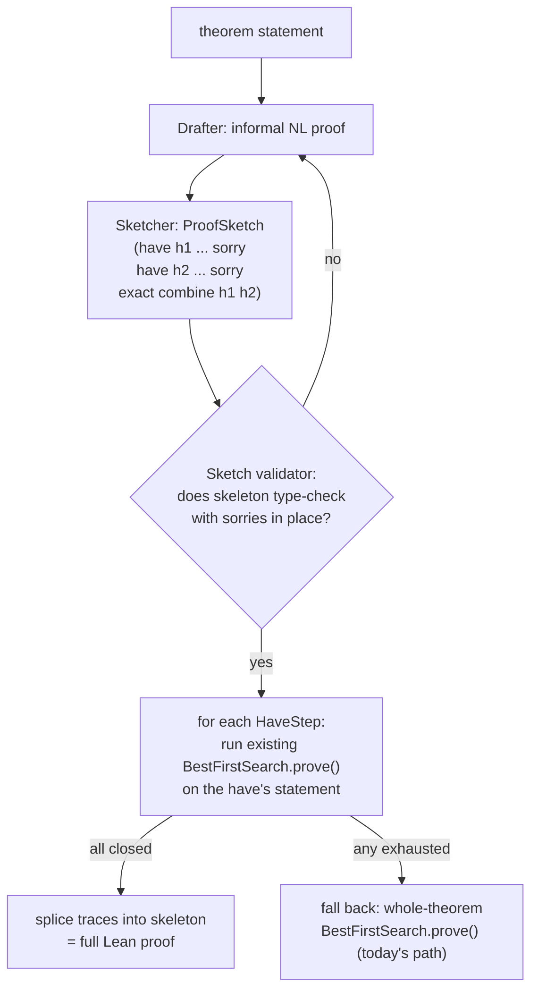

# Draft-Sketch-Prove: a proposed addition to the search pipeline

Status: design sketch only. Nothing in this doc has been implemented; no
existing file is modified. It proposes new modules that sit *alongside*
`search/best_first.py`, reusing it unchanged as the leaf-level solver.

## 1. Problem with the current pipeline

Today, `search/best_first.py` hands the raw theorem statement straight to
`BestFirstSearch.prove()`. At every node it asks the policy
(`policy/anthropic.py`) for `k` single-tactic candidates and searches the
tree those tactics induce. The LLM never gets to reason about the problem
as a whole — it only ever sees one `ProofState` at a time and is told
(`policy/base.py:21-23`) to output bare tactic lines with no explanation.
For anything beyond a few steps, this is a wide, mostly-blind search: the
model is pattern-matching tactic names instead of executing a plan.

## 2. Proposed addition: Draft → Sketch → Prove

Based on Jiang et al.'s "Draft, Sketch, and Prove" — split proving a
theorem into three stages, only the last of which touches Lean's tactic
search:

1. **Draft** — Claude solves the problem in natural language, no Lean
   involved. This is where "director thinking" (extended thinking, no
   sentence cap, discussed previously) actually pays off, since the model
   is doing real mathematical reasoning, not emitting syntax.
2. **Sketch** — Claude formalizes that informal proof into a Lean
   skeleton: the original goal restated as a sequence of `have` steps,
   each with a `sorry` in place of its proof, plus a final combinator
   tactic that assembles the `have`s into a closed proof of the original
   goal.
3. **Prove** — each `have` step is an independent, small theorem
   statement. Feed each one into the *existing, unmodified*
   `BestFirstSearch.prove()` exactly as it works today. Splice the
   resulting proof traces back into the skeleton in place of the
   `sorry`s.



## 3. Why the existing abstractions don't need to change

`core/policy.py` already calls out the `PolicyModel` protocol as "the
most important abstraction boundary in the codebase" — the search loop
only ever calls `get_tactics()`. The same pattern extends cleanly:

- A `have` step, once extracted from the sketch, is just another Lean
  theorem statement. `LeanExecutor.reset(theorem)` (`core/executor.py`)
  already accepts arbitrary theorem strings — a `have`'s statement
  restated as `theorem step1 : <type> := by` is not a special case.
- `ProofState`, `StepResult`, `TacticCandidate`, `SearchNode`, the value
  model, the executor capacity scaling — all reused as-is per sub-goal.
  Draft-sketch-prove is an orchestration layer *above* search, not a
  replacement for it.
- `prove_parallel()` (`search/best_first.py:323`) already runs `k`
  independent searches concurrently and takes the first success — the
  same function can run one `BestFirstSearch` per `have` step
  concurrently, since the steps are independent sub-goals.

## 4. New components (none of these exist yet)

Following the repo's existing convention of an abstract `core/` protocol
plus concrete `policy/`-style implementations:

| New file | Role | Modeled on |
|---|---|---|
| `core/sketch.py` | `HaveStep`, `ProofSketch` dataclasses — pure data, no Lean/API dependency | `core/proof_state.py` |
| `core/drafter.py` | `Drafter` protocol: `async def draft(problem: str) -> str` | `core/policy.py`'s `PolicyModel` |
| `core/sketcher.py` | `Sketcher` protocol: `async def sketch(problem: str, informal_proof: str) -> ProofSketch` | `core/policy.py`'s `PolicyModel` |
| `policy/anthropic_drafter.py` | Claude-backed `Drafter`. Extended thinking on, no output-format constraint. | `policy/anthropic.py` |
| `policy/anthropic_sketcher.py` | Claude-backed `Sketcher`. System prompt asks for a `have`-skeleton with `sorry`s; carries forward the `∀ → intro` rule from `policy/base.py:25-28`. | `policy/anthropic.py` |
| `search/sketch_search.py` | Orchestrator: draft → sketch → validate → per-step `BestFirstSearch.prove()` → splice. Imports `search/best_first.py` but does not modify it. | `search/best_first.py`'s own top-level `prove_parallel()` |

`ProofSketch` sketch (illustrative, not final):

```python
@dataclass(frozen=True)
class HaveStep:
    name: str            # "h1"
    statement: str       # the `have` goal, as a standalone Lean proposition
    depends_on: tuple[str, ...] = ()   # earlier have-names it may cite

@dataclass(frozen=True)
class ProofSketch:
    steps: tuple[HaveStep, ...]
    closing_tactic: str  # e.g. "exact combine h1 h2" — discharges the
                          # original goal given all have's are proved
```

## 5. New failure mode: the sketch itself can be wrong

This is the main risk flagged in conversation: formalizing an informal
proof can go wrong in ways that look nothing like today's
`_classify_tactic_error` categories (`search/best_first.py:63-83`).
Before spending any search budget:

- **Skeleton validation**: submit the full sketch to Lean with every
  `have` body replaced by `sorry`, via the existing
  `LeanExecutor.reset()`/`step()` calls, and check it type-checks
  end-to-end *except* for the sorries. If it doesn't, the sketch is
  malformed (wrong types, hallucinated hypothesis names, closing tactic
  doesn't actually combine the haves) — reject and re-draft rather than
  wasting budget searching for proofs of ill-formed sub-goals.
- **Fallback**: if sketching/validation fails after a bounded number of
  retries, fall back to today's direct `BestFirstSearch.prove()` on the
  raw theorem. Draft-sketch-prove should be strictly additive — never a
  regression path for problems it doesn't help on (e.g. `difficulty ==
  "easy"` problems in `eval/problems.py`, where sketching overhead likely
  isn't worth it).

## 6. Rollout order

1. `core/sketch.py` + `policy/anthropic_drafter.py` — draft only, no
   Lean, sanity-check output quality on a handful of `eval/problems.py`
   entries by hand.
2. `policy/anthropic_sketcher.py` + skeleton validator — confirm sketches
   type-check with sorries, before wiring up any sub-search.
3. `search/sketch_search.py` — wire drafter + sketcher + unmodified
   `BestFirstSearch` together, splice traces.
4. Run both paths through `eval/harness.py`'s pass@k machinery on the
   same problem set and compare — decide whether draft-sketch-prove
   becomes the default path or an escalation used after direct search
   fails/times out.
